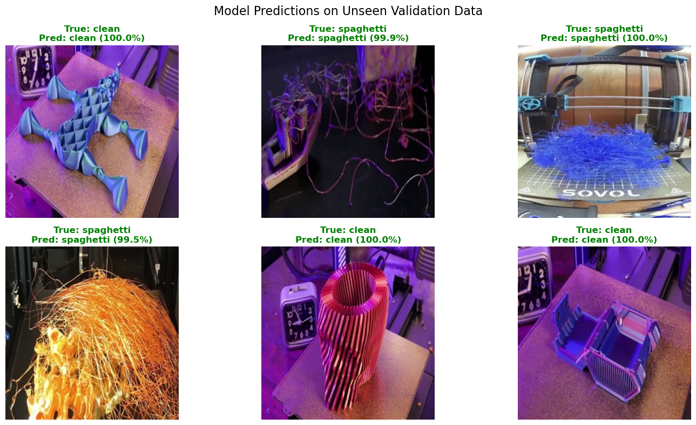

# 🖨️ 3D Printing Monitoring & Failure Detection system

A multi-model Deep Learning pipeline designed to monitor 3D printing processes in real-time, detect "Spaghetti" failures, track the toolhead, and identify bed adhesion issues.

---

## 📖 Project Overview
3D printing is a time-intensive process where failures can lead to significant material waste and hardware damage. This project provides an automated solution using three specialized models to ensure the printing process remains within nominal parameters.

## 🎯 Project Objective
The primary goal of this system is to **optimize resource management and operational efficiency** for 3D printer users. 

By providing real-time monitoring and automated failure detection:
* **Waste Reduction:** Early detection of "Spaghetti" or bed detachment allows users to terminate failed prints immediately, saving expensive filaments and materials.
* **Time Efficiency:** Users receive instant notifications upon failure detection, preventing hours of useless printing on a failed build.
* **Remote Monitoring:** Reduces the need for constant physical supervision, allowing the system to act as a "digital eye" that alerts the user only when intervention is required.

## 🧠 The Models

| Model | Task | Description |
| :--- | :--- | :--- |
| **Spaghetti Detection** | Classification | Identifies if the print has failed and turned into a "spaghetti" mess. |
| **Toolhead Detection** | Object Detection | Tracks the real-time position of the printer's extruder (Toolhead). |
| **Bed Adhesion** | Attention Model | Uses spatial attention to detect if the print is lifting or shifting from the bed. |

---

## 📷 Dataset & Data Engineering
A core contribution of this project is the creation of a custom dataset, as no comprehensive public datasets were available for these specific tasks.

### Classification (Spaghetti)
To build a robust classifier, we performed manual data curation:
* **Sourcing:** We identified and downloaded hundreds of 3D printing time-lapse videos from YouTube.
* **Refinement:** Instead of using raw footage, we used **video editing software** to manually isolate and trim specific segments where failures occurred vs. successful print intervals. This ensured high-quality, noise-free training labels.

### Detection Data (Toolhead)
For the object detection task (YOLO-based), we created a targeted dataset:
* **Sourcing:** We captured manual **screenshots** from various YouTube videos to represent a wide array of printer models, toolhead designs, and lighting conditions.
* **Annotation:** All bounding boxes were manually drawn using **AnyLabeling**, providing the model with precise ground-truth data for the toolhead position.

* **Resolution Scaling:** All captured images and video frames were resized to a standardized resolution of **224x224 pixels**.
## 📊 Exploratory Data Analysis (EDA)

### Classification (Spaghetti)
We performed a targeted EDA to ensure our classification model (Spaghetti vs. Good Print) learns actual visual features rather than dataset artifacts:

* Class Imbalance Check: We verified a balanced distribution between "Good" and "Spaghetti" samples to prevent the model from "cheating" by simply predicting the majority class.

* Visual Sanity Checks: Conducted random sampling to ensure data integrity and confirm that all "Spaghetti" labels accurately represent actual print failures.

* Structural Consistency ("Ghost" Images): We generated average images for both classes. "Good" prints showed a structured, consistent shape, while "Spaghetti" resulted in a chaotic blur, confirming distinct structural features for the model to learn.

* Environmental Bias (Lighting): We analyzed brightness distribution across all samples to ensure the model learns based on texture and geometry rather than being biased by lighting conditions (e.g., night vs. day shots).

### Detection Data (Toolhead)

For the Object Detection model (YOLO), we performed a specialized EDA to ensure the model effectively learns to locate the toolhead across different environments:

* Ground Truth Verification: We visualized random samples of our manual annotations to ensure the bounding boxes created in AnyLabeling perfectly align with the toolhead in the screenshots.

* Box Aspect Ratio Analysis: We analyzed the height-to-width ratios of our boxes. This ensures our toolhead dimensions are compatible with YOLO's anchor boxes, helping the model predict shapes accurately rather than struggling with unusual proportions.

* Location Heatmap: We mapped the spatial distribution of the toolhead across all images. This allowed us to verify that the toolhead appears in various positions (corners, edges, center), preventing the model from becoming biased toward a single "hotspot" in the frame.

## 🛠️ Data Augmentations

### Classification (Spaghetti)

* Data Preprocessing: All images were resized from their original resolution to 224x224. This standardization ensures computational efficiency and prevents the model from being overburdened by excessively high-dimensional input.

### Detection Data (Toolhead)

### Data Augmentation Summary

| Augmentation | Description | Rationale | Metric |
| :--- | :--- | :--- | :--- |
| **Mosaic** | Combines four different training images into a single image in varying ratios. | Improves the model's ability to detect small objects and enriches spatial context without increasing the batch size. | 1.0 |
| **Mixup** | Overlays two different training images and their labels using a weighted linear combination. | Regularizes the model to favor simple linear behavior between classes, reducing overconfidence and improving generalization. | 0.1 |
| **Degrees** | Randomly rotates the input image within a specified range of degrees. | Enhances robustness to variations in object orientation, ensuring the model recognizes objects that are not perfectly aligned. | 15° |
| **Translate** | Shifts the image horizontally or vertically by a fraction of the total width/height. | Helps the model become invariant to the position of the object within the frame, simulating cases where the object is partially off-center. | 0.1 |
| **Scale** | Randomly zooms in or out of the image by a specified gain factor. | Teaches the model to recognize objects at various distances and sizes, improving performance on both near and far subjects. | 0.5 |
| **Fliplr** | Flips the image horizontally (left to right) with a given probability. | Doubles the diversity of the dataset by simulating different perspectives, assuming the horizontal orientation does not change the object's class. | 0.5 |

## 🤖 Model Selection and Training

### Classification (Spaghetti)

* SOTA Efficiency: YOLOv26 balances millisecond-level inference speed with superior mAP for high-performance real-time monitoring.

* Area Attention (A2): Integrated attention modules capture global context, critical for identifying complex spatial anomalies and failures.

* Small Object Sensitivity: Refined receptive field control ensures high precision when detecting minute or early-stage defects.

* Robust Generalization: Optimized for "Bag of Freebies" like Mosaic and Mixup to maintain high accuracy across diverse environments.

### Detection Data (Toolhead)

* SOTA Efficiency: YOLOv26 balances millisecond-level inference speed with superior mAP for high-performance real-time monitoring.

* Area Attention (A2): Integrated attention modules capture global context, critical for identifying complex spatial anomalies and failures.

* Small Object Sensitivity: Refined receptive field control ensures high precision when detecting minute or early-stage defects.

* Robust Generalization: Optimized for "Bag of Freebies" like Mosaic and Mixup to maintain high accuracy across diverse environments.

## 📈 Evaluation

### Classification (Spaghetti)

### Detection Data (Toolhead)

## 💯 End Summary

---

## 🛠️ Tech Stack
* **Language:** Python
* **Deep Learning Framework:** PyTorch
* **Object Detection:** YOLO
* **Data Labeling:** AnyLabeling
* **Video Processing:** OpenCV & Manual Video Editing Tools

---
