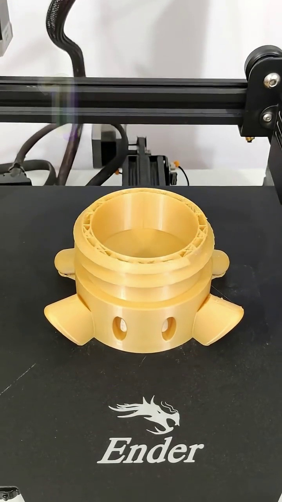

# 🖨️ 3D Printing Monitoring & Failure Detection system

A multi-model Deep Learning pipeline designed to monitor 3D printing processes in real-time, detect "Spaghetti" failures, track the toolhead, and identify bed adhesion issues.

---

## 📖 Project Overview
3D printing is a time-intensive process where failures can lead to significant material waste and hardware damage. This project provides an automated solution using three specialized models to ensure the printing process remains within nominal parameters.

## 🎯 Project Objective
The primary goal of this system is to **optimize resource management and operational efficiency** for 3D printer users. 

By providing real-time monitoring and automated failure detection:
* **Waste Reduction:** Early detection of "Spaghetti" or bed detachment allows users to terminate failed prints immediately, saving expensive filaments and materials.
* **Time Efficiency:** Users receive instant notifications upon failure detection, preventing hours of useless printing on a failed build.
* **Remote Monitoring:** Reduces the need for constant physical supervision, allowing the system to act as a "digital eye" that alerts the user only when intervention is required.

## 🧠 The Models

| Model | Task | Description |
| :--- | :--- | :--- |
| **Spaghetti Detection** | Classification | Identifies if the print has failed and turned into a "spaghetti" mess. |
| **Toolhead Detection** | Object Detection | Tracks the real-time position of the printer's extruder (Toolhead). |
| **Bed Adhesion** | Attention Model | Uses spatial attention to detect if the print is lifting or shifting from the bed. |

---

## 📊 Dataset & Data Engineering
A core contribution of this project is the creation of a custom dataset, as no comprehensive public datasets were available for these specific tasks.

### 1. Classification Data (Spaghetti Detection)
To build a robust classifier, we performed manual data curation:
* **Sourcing:** We identified and downloaded hundreds of 3D printing time-lapse videos from YouTube.
* **Refinement:** Instead of using raw footage, we used **video editing software** to manually isolate and trim specific segments where failures occurred vs. successful print intervals. This ensured high-quality, noise-free training labels.

### 2. Detection Data (Toolhead)
For the object detection task (YOLO-based), we created a targeted dataset:
* **Collection:** We captured manual **screenshots** from various YouTube videos to represent a wide array of printer models, toolhead designs, and lighting conditions.
* **Annotation:** All bounding boxes were manually drawn using **AnyLabeling**, providing the model with precise ground-truth data for the toolhead position.

### 3. Image Preprocessing
To optimize the data for training and ensure compatibility with our neural network architectures:
* **Resolution Scaling:** All captured images and video frames were resized to a standardized resolution of **224x224 pixels**.
* **Rationale:** This resolution provides an optimal balance between computational efficiency and preserving enough spatial detail for both failure classification and toolhead localization.

### 4. Bed Adhesion (Attention Mechanism)
* **Focus:** This model utilizes an **Attention Mechanism** to monitor the interface between the printed object and the heatbed. It is designed to trigger an alert when the model detects subtle displacements or "warping" that indicate the print has detached.

---

## 🛠️ Tech Stack
* **Language:** Python
* **Deep Learning Framework:** PyTorch
* **Object Detection:** YOLO
* **Data Labeling:** AnyLabeling
* **Video Processing:** OpenCV & Manual Video Editing Tools

---
